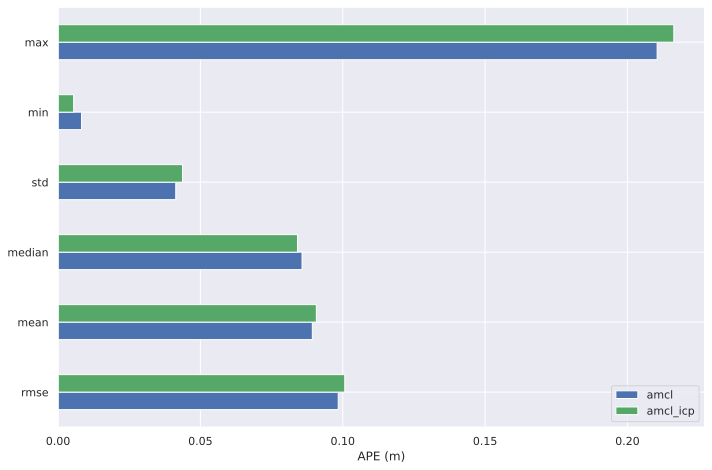
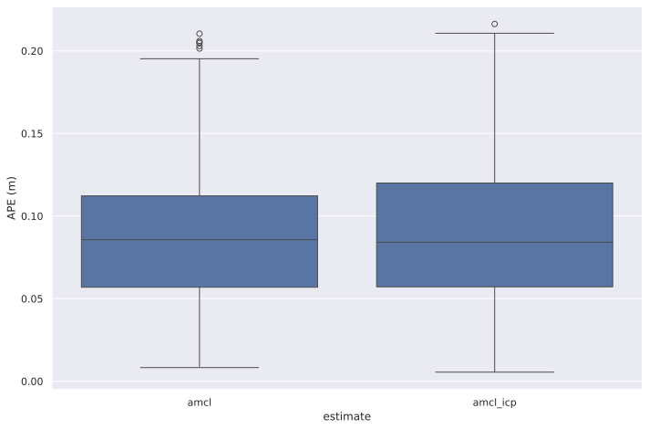
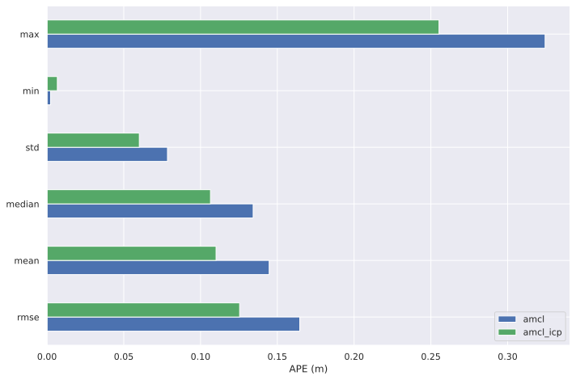
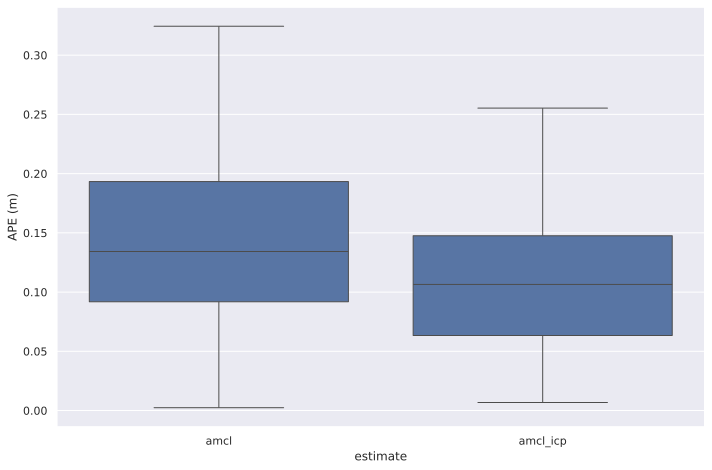

# Scan Matching Odometry
## Description
This package perform lidar odometry using scan-to-scan matching algorithm (ICP). Using it with AMCL can help you increase localization accuracy in wheel slip conditions.
## Results
### Normal wheel conditions
Under normal conditions, the accuracy of the AMCL+ICP method is not inferior to AMCL+Wheel odometry

### Wheel slip conditions
Under wheel slip conditions, the accuracy of AMCL+ICP is superior to AMCL+Wheel odometry

